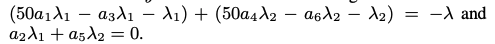
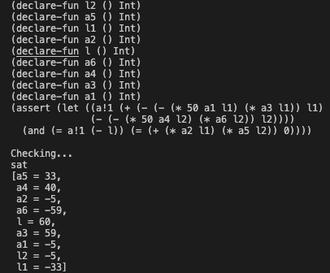
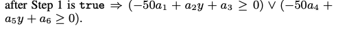
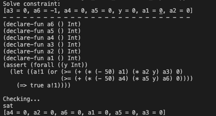

# Assignment 4 - Program Analysis Using Constraints

Jiwon Lee  
Parker Mitchell

## Approach
For this assignment, we spent a lot of time to understand the paper better before we started playing around with the Z3. 

We had little trouble installing z3 python version at first because some libraries got overwritten when we installed both 'z3' and 'z3-solver'. When both packages were installed, python didn't recognized the imported z3 library. We solved this issue by uninstalling 'z3' and only keeping 'z3-solver' package. 

After the installation, we ran simple example from the z3-solver documentation to see how it works (__simple_sat.py__). This gave us some ideas what calls we should be making to get the results we want to see (i.e. satisfiability, model). Then we created our own __simple_smt.py__ file to test simpler yet similar expression that we want to run later. 

We worked on this assignment under the impression that lambda 1 and lambda 2 are x and y respectively. We aren't as confident if our assumption is correct or not since there were few parts in the paper that we had some trouble grasping.

After we got a little more familiar with Z3, we worked towards implementing some of what was in the Gulwani paper. We focused on the first constraint, `true --> I[-50/x]` for our analysis and work.

Our first attempt at this is defined by __gsv_first_constraint_expanded.py__. In this file, we use Z3Py, a python wrapper for Z3, to help us determine satisfying assignments for the mentioned constraint.  
 [1]

We used the expanded form of the constraint, using Farkas' lemma as discussed in lecture, to pass into the solver. Our file prints out the s-expression when transforming the python statements into Z3-recognizable code, and then shows whether or not it is satisfiable. We also show the satisfying assignment of values if it is satisfiable. Here are our results for this:  
 

Our second attempt at this same constraint is defined by __gsv_first_constraint_implies.py__. Our approach with this attempt to solve the same constraint stems from a thought of reducing work. During lecture, we found it a bit daunting to perform all those logical expansions/reductions (using De Morgan's Laws), and so we were looking for a potentially easier way to approach that. In the process, when digging into Z3 we saw that they offered 'Implies' and 'ForAll' functionality to help deal with such logical expressions. We wanted to test these out, and see if we could reduce our work and have Z3 solve this constraint without using Farkas' lemma and performing tiring expansions. We used this as our reference:  
 

The first two lines of our output just show the result of using 'solve()' instead of s.check/s.model, **and** we did not use a 'For all y' here. However, in general we don't believe that our approach worked. In the paper, they discuss how their tool discovers that their inductive variant was `(x < 0) | (y > 0)`. However, the satisfying assignment that our tool found when we did use a 'For all y' did not include an assignment for `y`, which baffled us, but when didn't use for all, there was an assignment for `y` (which was 0).  
 

 This confused us a bit, but since both approaches yielded what we thought were incorrect assignments, we assumed our general approach was incorrect. After this, we were well past our 'time limit' so we decided to stop there.

## References
1. S. Gulwani, S. Srivastava, and R. Venkatesan, “Program analysis as constraint solving,” in Proceedings of the 2008 ACM SIGPLAN conference on Programming language design and implementation  - PLDI ’08, Tucson, AZ, USA, 2008, p. 281, doi: 10.1145/1375581.1375616.

